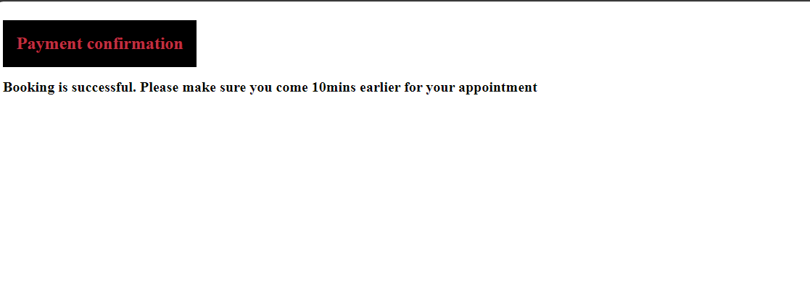
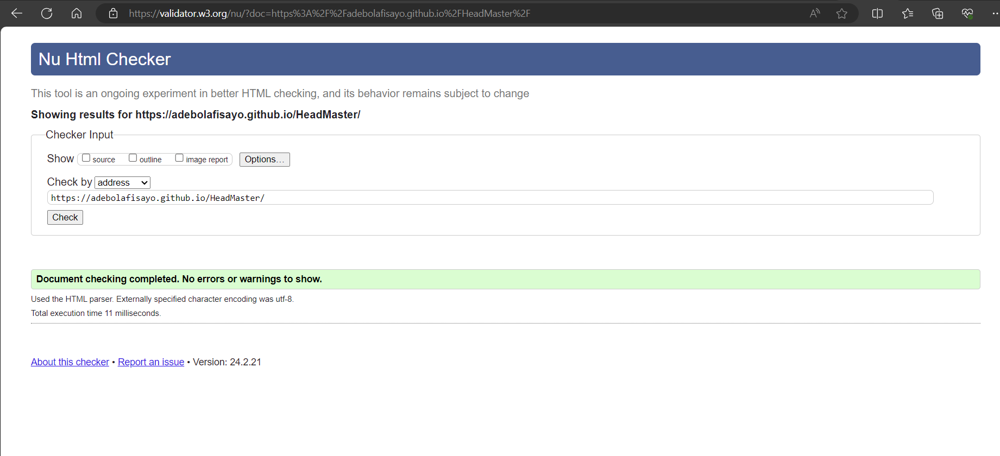
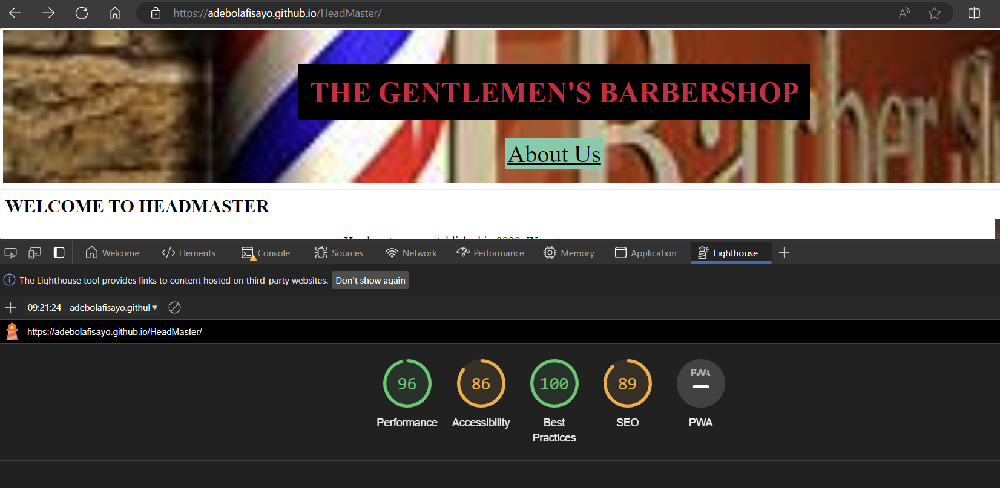
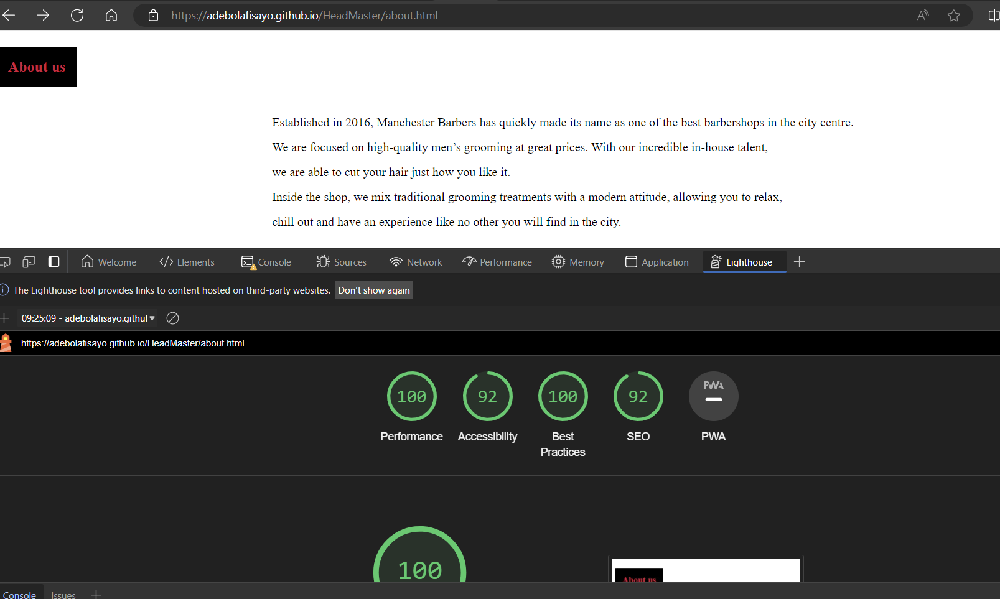
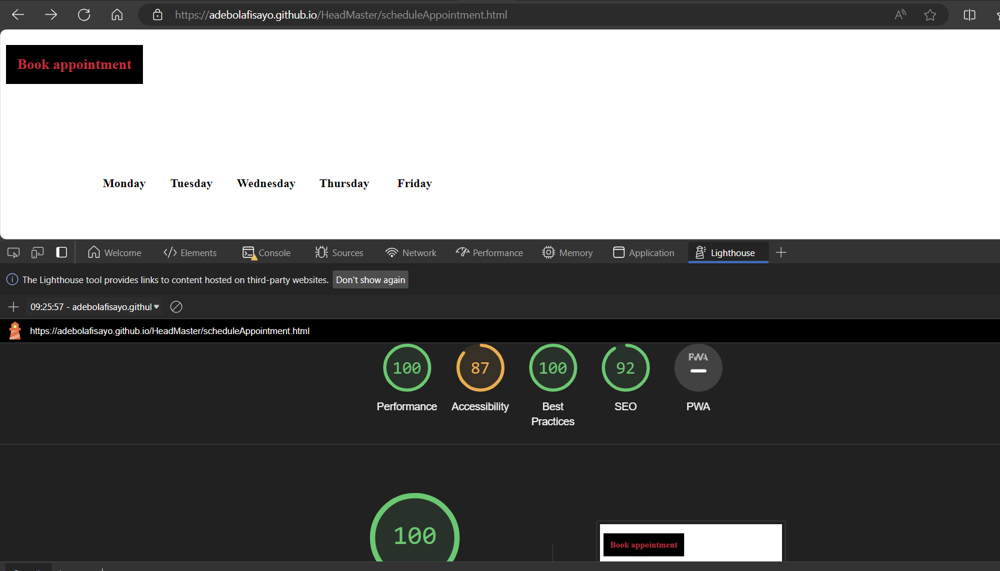

Welcome to Headmaster README file. We are a classy barbershop located in the heart of Leeds, providing topnotch grooming services for our esteemed clients. 

This document serves as a guide to understand who we are, what we do, and how to interact with us.

Features

Navigation

* The navigation button should be by the left of the page

* The navigation text should be black in colour

* The navigation text should be in upper case

* When the navigation link is clicked, it should take the customer to the specific section

About Us (Homepage)

* Given a customer lands on the homepage, the "about us" text is displayed right under a text that says "THE GENTLEMEN'S BARBERSHOP"

* The about us text background should have a colour of mediumaquamarine

* When the "about us" button is click, it navigates customer to another page  

About Us Page

* Given a customer is navigated to the "about us" page, show a paragraph that describes the headmaster business

* On the headmaster "about us" page display the price list

Book An Appointment

* Given a customer clicks on "BOOK AN APPOINTMENT" button on the navigation link in the homepage, then they land on "Schedule appointment" button

* When the "schedule appointment" is clicked, customer is navigated to book appointment page

* When a customer click on a timeslot, they are navigated to the User information page.

User Information Page

* Add fields for details, more information, more information, other services, bank information to the user information page

* Add a submit and reset button

* Add validation to firstname, lastname, email, sort code and account number on the user information page

Payment Confirmation Page

* Given a user has submitted the user information form, then navigate the customer to payment confirmation page

Testing

* I can confirm this page works in chrome and microsoft edge

* I can confirm the form in the user information page works 

* I can confirm the navigation links works and the pages are responsive

Bugs

* When I was working on other pages, I noticed the css was not applied 
* I resolved this by using the link tag below
<link rel="stylesheet" href="assets/css/style.css"> 

Validator Testing
* No error was returned when i validated through W3C validator

Accessibility 

* Accessibility passed based on lighthouse used in dev tool
* Homepage

* About Us Page

* Book Appointment Page

Unfixed Bug
* No unfixed bug

Deployment
* The site was deployed to Github pages. The steps to follow for deployment are :
* Navigate to settings on the repository
* Click on pages and then select main as the branch
* Save the main page, click on the link generated
* The live link can be found here https://adebolafisayo.github.io/HeadMaster/

